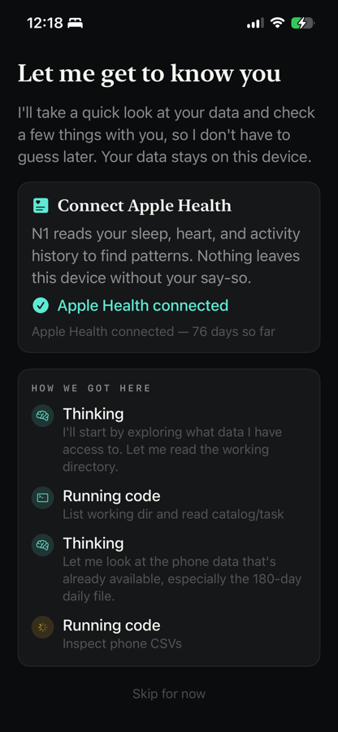
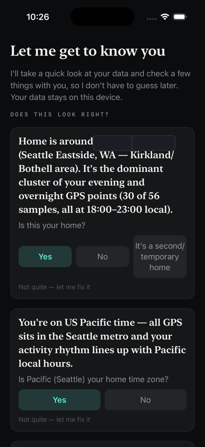
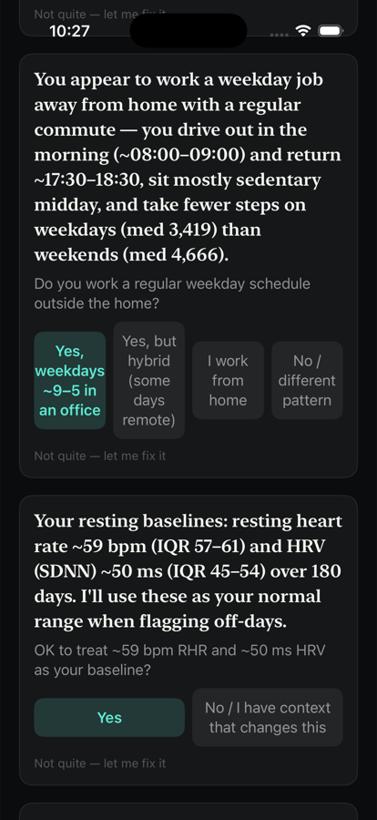
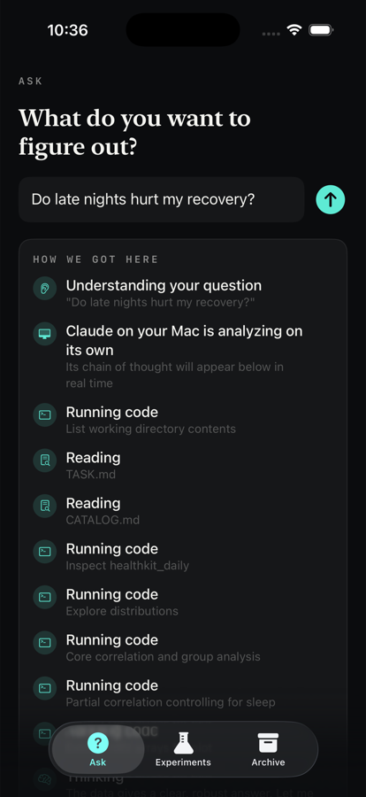
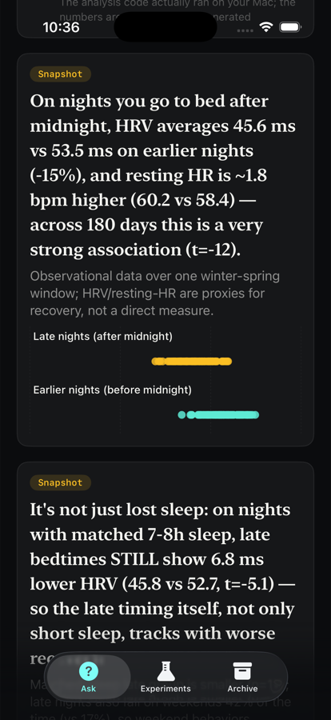
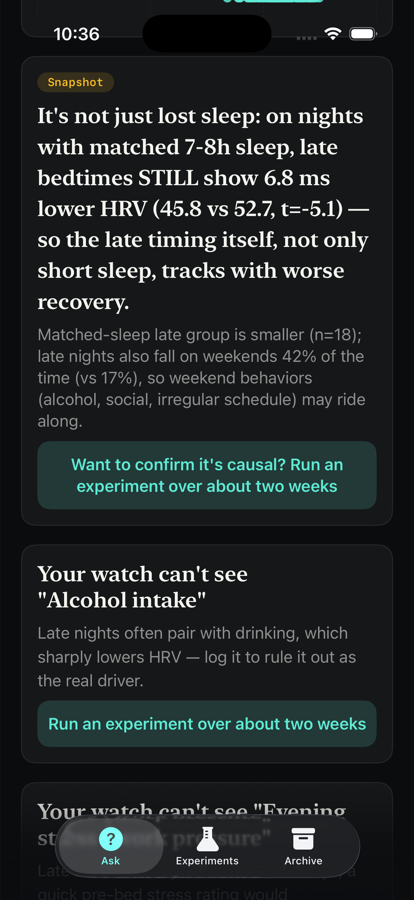
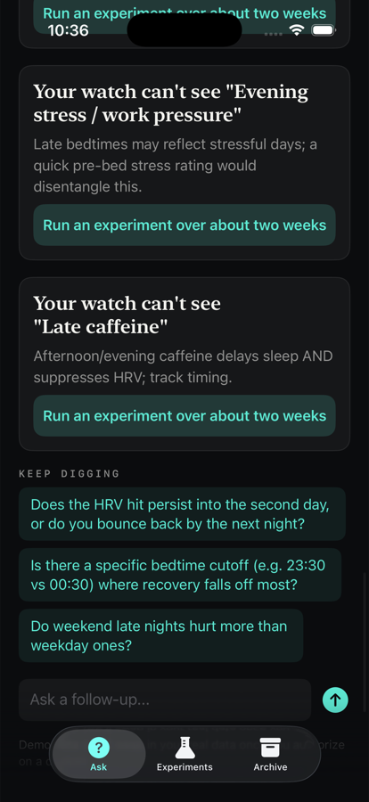
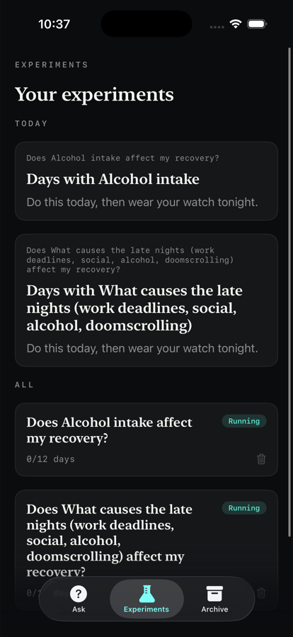
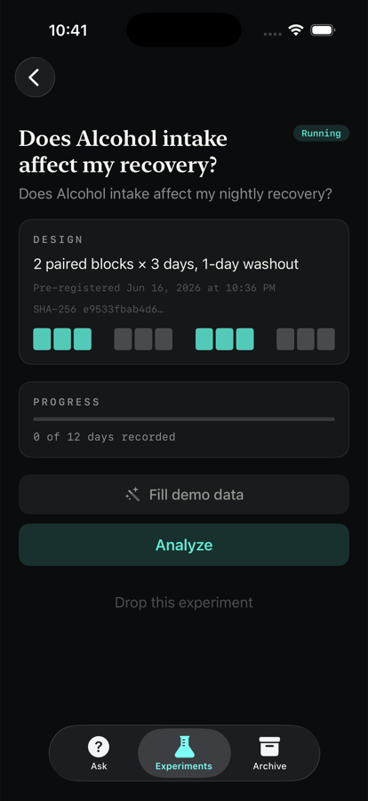

# N1 — your own data scientist, on your own data

**Ask a question about your health and behavior. An AI data scientist investigates *your* data, on *your* machine, and answers honestly — then helps you run a real experiment to confirm cause.**

🌐 Website: **https://zzhiyuann.github.io/n1-site/**

N1 is two pieces:

- an **iOS app** that holds your data (Apple Health + optional on-device location) and asks the questions, and
- a **local backend** (`server/n1d.mjs`) that runs the [Claude Code](https://docs.anthropic.com/en/docs/claude-code) CLI as an *autonomous* analyst — it writes and runs its own analysis code over your data, shows its work, and never fabricates numbers.

Everything runs on hardware you own. Your raw data never goes to a third party — only aggregated context is sent to *your* backend on *your* Mac.

> ⚠️ N1 is a personal research / quantified-self tool, **not medical advice**. It reports associations in your own historical data, and is careful to say so.

---

## What it actually does

### 1. It gets to know you — from your real data, not a questionnaire

On first run, N1 reads your Apple Health history and proposes the **ground truth** it inferred, for you to confirm or correct. No forms — it figures out your home, time zone, sleep schedule, work pattern, and physiological baselines from the data itself, and asks.

<p align="center">
  
  &nbsp;
  
  &nbsp;
  
</p>

> *"Home is around ≈47, −122 (the Seattle area) … the dominant cluster of your evening and overnight GPS points (30 of 56 samples). Is this your home?"*
>
> *"You appear to work a weekday job away from home with a regular commute — out ~08:00, back ~17:30 … Do you work a regular weekday schedule outside the home?"*
>
> *"Your resting baselines: resting heart rate ~59 bpm (IQR 57–61) and HRV ~50 ms (IQR 45–54) over 180 days. OK to use these as your normal range?"*

Whatever you confirm becomes durable context the agent reuses — so it never has to guess (or re‑ask) again.

### 2. You ask anything; it investigates transparently

Ask in plain language. The agent decides what to look at, writes and runs real analysis code, and streams every step so you can see *how* it got there.

<p align="center">
  
  &nbsp;
  
  &nbsp;
  
</p>

> **Q: "Do late nights hurt my recovery?"**
>
> *"On nights you go to bed after midnight, HRV averages 45.6 ms vs 53.5 ms on earlier nights (−15%), and resting HR is ~1.8 bpm higher — across 180 days this is a very strong association (t = −12)."*
>
> *"It's not just lost sleep: on nights with matched 7–8 h sleep, late bedtimes **still** show 6.8 ms lower HRV (t = −5.1) — so the late timing itself, not only short sleep, tracks with worse recovery."*

Every number comes from code the agent actually ran (the open-source [`N1Stats`](packages/N1Stats) engine + its own scripts) — the model narrates, it never invents figures. And it volunteers its own limits:

> *"Matched-sleep late group is smaller (n = 18); late nights also fall on weekends 42% of the time, so weekend behaviors (alcohol, social) may ride along."*

### 3. It knows what it *can't* see — and turns that into an experiment

When the honest answer needs something your sensors can't capture, N1 says so and offers to **find out for real**.

<p align="center">
  
  &nbsp;
  
  &nbsp;
  
</p>

> *"Your watch can't see **alcohol intake**. Late nights often pair with drinking, which sharply lowers HRV — log it to rule it out as the real driver. → Run an experiment over about two weeks."*

That spins up a proper **N-of-1 experiment**: a pre-registered, randomized crossover (paired blocks + washout, locked with a SHA-256 of the spec), with **self-report logging** for the things sensors miss — on a schedule the agent designs (e.g. a pre-bed stress rating, or "alcohol today?"), with reminders and a "next due" heads-up. You can run several at once, and drop any. When enough days are collected, N1 analyzes it with a within-person Bayesian model and gives you an effect size with honest uncertainty.

---

## How it works

```
┌─────────────────────┐         Tailscale (or LAN/localhost)        ┌───────────────────────────┐
│  iOS app (N1)        │  ───────────────────────────────────────▶  │  Mac: n1d backend          │
│  • Apple Health      │   aggregated CSV context (no raw export)    │  • runs Claude Code CLI    │
│  • optional location │                                             │    as an autonomous agent  │
│  • asks questions    │  ◀───────  jobId → poll steps + result ───  │  • writes & runs analysis  │
│  • runs experiments  │                                             │  • numbers from N1Stats    │
└─────────────────────┘                                             └───────────────────────────┘
```

- **Numbers vs narration are separated by design.** Statistics come from deterministic, open-source code (`packages/N1Stats`) and the agent's own scripts; the LLM only understands, orchestrates, and explains. It is never the source of a number.
- **Background-proof.** The phone never holds a long connection — the backend returns a job id instantly and the app polls short requests, so backgrounding or pulling the status bar can't interrupt an analysis.
- **The agent's method is an editable handbook** ([`agent/handbook.md`](agent/handbook.md)), not hardcoded — reloaded per request, so you can tune how your data scientist thinks without touching code.
- **Local-first.** Raw samples stay on your devices; only aggregated context reaches your own Mac.

### Design language

N1 is styled as a **scientific instrument** — calm, precise, trustworthy — rather than a playful health app:

- A dark "instrument panel" surface with a single restrained accent color (at most one signal accent per screen); amber is reserved for uncertainty and adherence.
- All numbers are set in a monospaced face, for a "meter reading" feel; hypotheses and conclusions use a serif, interface text the system sans.
- Tufte-style charts: high data-ink, no gridline clutter or gradients; posterior distributions shown as translucent areas, effect sizes always with intervals.
- Motion is brief (≤ 200 ms, ease-out, no bounce) so data views stay still and legible.

---

## Get it running

**Prerequisites:** macOS + Xcode · Node 18+ · the **Claude Code CLI** installed and authenticated (`claude` on your `PATH`) · `xcodegen` (`brew install xcodegen`) · an Apple Developer account (to install on a real device) · and, to use it on your phone, **[Tailscale](https://tailscale.com)** — the easiest way to let your phone reach your Mac.

### The easy way — let Claude Code set it up

Because N1 already *runs* on Claude Code, it can install itself. Clone the repo, then in the repo root:

```bash
claude          # then type:  /setup-n1
```

That runs the [`AGENT_SETUP.md`](AGENT_SETUP.md) runbook: it checks your prerequisites, starts the backend, helps you configure signing and networking, builds and installs the app, and verifies it end to end — asking you only for the few choices that are yours (device vs simulator, your Apple Team ID + bundle id, Tailscale). If you don't use the slash command, just tell Claude: *"Read AGENT_SETUP.md and set up N1 for me."*

### The manual way

Full detail in **[SETUP.md](SETUP.md)**; the short version:

**1 · Backend** — the local analyst:
```bash
cd server
node n1d.mjs                      # leave running
curl -s localhost:8787/health     # → {"ok":true,"model":"...","sources":N}
```

**2 · Networking** — how your phone reaches your Mac:
- *Phone:* install Tailscale on Mac + phone (same account); your Mac's address is `tailscale ip -4` → use `http://100.x.x.x:8787`.
- *Simulator:* just use `http://127.0.0.1:8787`.

**3 · App** — sign and build:
```bash
cd app
cp N1/Local.xcconfig.template N1/Local.xcconfig   # then fill in:
#   DEVELOPMENT_TEAM = <your 10-char Apple Team ID>
#   PRODUCT_BUNDLE_IDENTIFIER = <something unique, e.g. com.you.n1>
xcodegen generate
# open N1.xcodeproj in Xcode and build to your iPhone (or simulator)
```

**4 · First run** — open **Settings** (the gear, top-right of Archive), set the **Server URL** to your Mac's address, tap **Test connection**; then in onboarding tap **Connect Apple Health** → *Turn On All*; optionally enable Location.

Configuration lives in env vars (backend: `PORT`, `N1_MODEL`, `N1_HANDBOOK`, `N1_EXTRA_SOURCES_DIR`) and the in-app Settings (server URL) — nothing personal is baked into source.

> **Security:** the backend runs `claude` with code execution over your data — only expose it on a trusted private network (Tailscale is private to your account; for local-only use `127.0.0.1`).
>
> **Optional extra data sources:** N1 is fully featured on Apple Health + its own location alone. If you keep other personal data as JSON, point `N1_EXTRA_SOURCES_DIR` at it and the agent will discover and use it too — but nothing requires it.

---

## Privacy & security

- Your health and location data live on your phone; analysis runs on your Mac. No third-party servers.
- The backend runs `claude` with code execution over your data — **only expose it on a trusted private network** (Tailscale is private to your account; for local-only use `127.0.0.1`).
- N1 reports **associations** in your own data and says so plainly. It is not a medical device and gives no diagnosis or treatment advice.

## Repo layout

| Path | What |
|------|------|
| `app/` | the iOS app (SwiftUI, XcodeGen) |
| `server/n1d.mjs` | the local autonomous-analysis backend |
| `agent/handbook.md` | the agent's editable methodology |
| `packages/N1Stats/` | the open-source within-person Bayesian stats engine |
| `whitepaper/` | the methodology write-up |

## License

MIT © 2026 Zhiyuan Wang. See [LICENSE](LICENSE).
